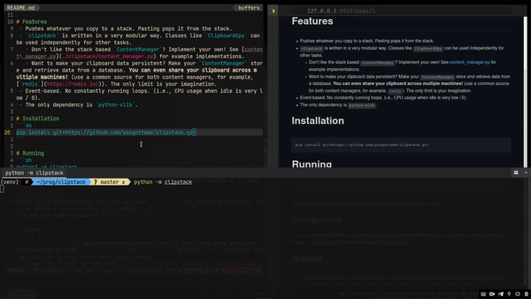

# clipstack
How many times have you needed to paste the same copied text multiple times?  
How many times have you needed to copy multiple pieces of texts and paste it without switching windows?

For me personally, the second count was much bigger than the first. Hence, this.

`clipstack` stores your clipboard contents in a stack. Copying text pushes to the stack. Pasting pops it. As simple as that!  
Did you actually want to paste that thing at two places? No worries, just copy it twice!



High quality original speed video [here](.demos/demo.mp4)

# Features
 - Pushes whatever you copy to a stack. Pasting pops it from the stack.
 - `clipstack` is written in a very modular way. Classes like `ClipboardSpy` can be used independently for other tasks.
   - Don't like the stack based `ContentManager`? Implement your own! See [content\_manager.py](./clipstack/content_manager.py) for example implementations.
   - Want to make your clipboard data persistent? Make your `ContentManager` store and retrieve data from a database. **You can even share your clipboard across multiple machines!** (use a common source for both content managers, for example, [`redis`](https://redis.io/)). The only limit is your imagination.
 - Event-based. No constantly running loops. (i.e., CPU usage when idle is very low / 0).
 - The only dependency is `python-xlib`.

# Installation
```sh
pip install git+https://github.com/yoogottamk/clipstack.git
```

# Running
```sh
python3 -m clipstack
```
By default, this ignores all images and stores the clipboard contents on a stack.

## Configuration
There is no configuration file. If you want `clipstack` to behave differently, you can write a simple python file similar to [`__main__.py`](./clipstack/__main__.py) and run that instead of `clipstack`.

# Issues
   - [`INCR`](https://www.x.org/releases/X11R7.6/doc/xorg-docs/specs/ICCCM/icccm.html#incr_properties) and maybe more protocols that I don't even know about are not supported by both `ClipboardSpy` and `Clipboard`. Without `INCR`, it might not be possible to copy/paste very large chunks.
 - Images don't work for now and `clipstack` actively ignores it. When you copy an image, `clipstack` will stop running until you copy a supported content again. For now, [only images are being ignored](./clipstack/__main__.py). If you find another type that is not supported, kindly open an issue (or a PR 😛).
 - Applications are weird. None of them follow a consistent selection request pattern. A [very weird hack](./clipstack/clipboard.py) [check function `_check_update_contents`] had to be used in order to get around this problem. A consequence of this hack is that pasting multiple times "very fast" is not supported. Currently, the timeout is 200ms but I might change it if I find that this is too short or too long.
 - The interface for [`clipboard.py`](./clipstack/clipboard.py) is bad, it should be as easy to use as `ClipboardSpy`.
 - Not memory efficient. Maybe someone only copies and never pastes? They would fill the stack without emptying it and it might take a lot of memory. I don't see this happening in a normal scenario though.

### Aside
I don't know a lot about X and this was mostly created (in less than a day) by searching stackoverflow, open source code and sometimes translating it to python. Due to this, some of the identifier names might not make sense, some doc strings might be wrong or much better ways might exist of doing what this is doing. If you find any such issues, please educate me 🙏.

# References
 - https://www.jwz.org/doc/x-cut-and-paste.html
 - https://www.uninformativ.de/blog/postings/2017-04-02/0/POSTING-en.html
 - https://stackoverflow.com/questions/8755471/
 - https://stackoverflow.com/a/44992938/10627913
 - https://stackoverflow.com/a/44992320
 - https://github.com/python-xlib/python-xlib/tree/master/examples
